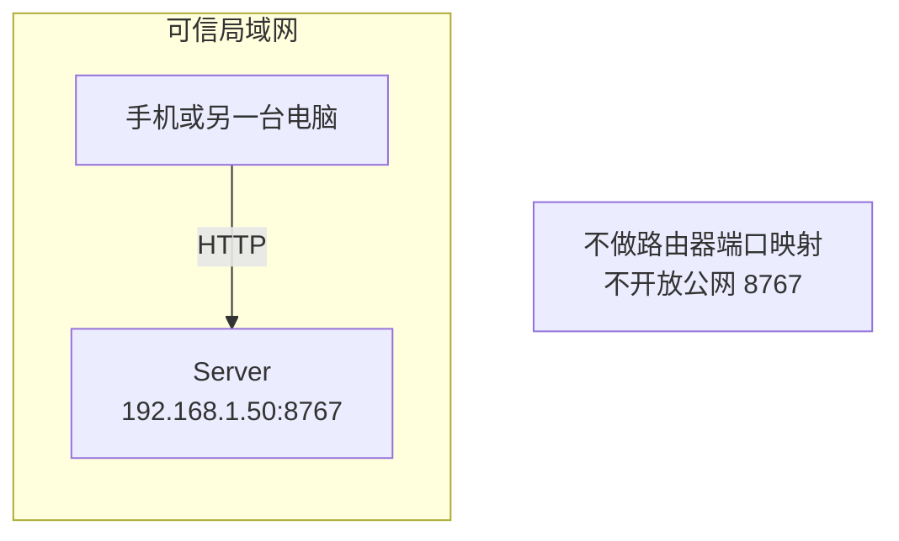
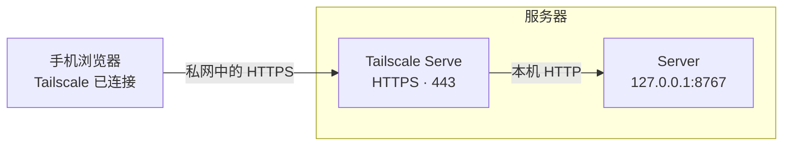
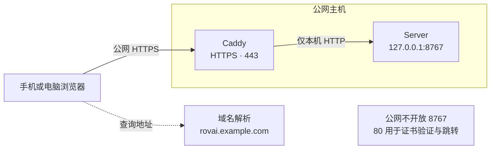

# Rovai Server 部署与远程访问指南

在 Linux 主机上运行服务，通过手机、平板或电脑浏览器访问。项目文件和执行进程保留在服务器上。

> **TODO：尚无正式 Server Release。本文的下载与安装部分待补齐，以下配置以程序已安装为前提。**

## 访问方式

- **局域网 HTTP：仅限可信局域网。**
- **Tailscale：推荐私有远程访问，可使用 Tailscale Serve 提供 HTTPS。**
- **公网访问：必须通过 HTTPS 反向代理，不直接暴露服务的 HTTP 端口。**

| 方式 | 适用场景 | 客户端要求 | 地址示例 |
| --- | --- | --- | --- |
| [局域网 HTTP](#局域网-http) | 同一家庭或办公网络 | 连接可信局域网 | `http://192.168.1.50:8767` |
| [Tailscale 私有访问](#tailscale-私有访问) | 跨网络访问自己的主机 | 安装并连接 Tailscale | `https://设备名.网络名.ts.net` |
| [公网 HTTPS](#公网-https) | 通过固定域名访问公网主机 | 普通浏览器 | `https://rovai.example.com` |

以下 IP、域名和账号均为示例，请替换为实际值。

## 安装与准备

### 安装（TODO）

- [ ] 发布正式 Server Release 后，补充下载入口、安装命令和校验步骤。

预览包操作暂见[原生 Server 安装说明](../development/server-preview.md#安装和启动)。

Linux 发布目标为 **GNU x86_64、glibc 2.35，Ubuntu 22.04+ / Debian 12+**，暂不包含 Alpine/musl 和 Linux ARM64。平台与 Runtime 支持状态分别记录，见[当前版本](../versions/README.md)和 [Runtime 兼容性清单](../runtime-compatibility.md)。

### 运行账号与数据目录

使用普通用户安装和运行服务，Runtime 也在同一账号下安装、登录。下文 systemd 模板使用账号 `rovai`；已有其他账号时替换模板中的用户名和主目录。

默认数据目录为 `~/.rovai-server`，HTTP 端口为 **8767**。Desktop 托管的 Web 服务默认使用 **8766**，数据和登录凭据属于各自实例。

可在本机启动后查看登录页：

```sh
rovai-server --listen 127.0.0.1:8767
```

本机浏览器打开 `http://127.0.0.1:8767`；无桌面环境时，在另一个终端检查：

```sh
curl -I http://127.0.0.1:8767/
```

切换下文的启动方式前，按 **Ctrl-C** 等待当前进程退出。需要自定义数据目录时，在启动及 Token 查询命令中统一加入 `--data-dir /absolute/path`。

## 局域网 HTTP

仅用于自己控制的可信网络。HTTP 不加密登录凭据和工作内容。



### 1. 确定局域网地址

在服务器执行：

```sh
ip -br -4 addr
```

选择手机所在网络对应的网卡地址，例如 `192.168.1.50/24`。可在路由器中保留 DHCP 地址，避免重启后变化。

### 2. 启动服务

绑定实际局域网 IP，并显式允许 HTTP：

```sh
rovai-server \
  --listen 192.168.1.50:8767 \
  --allow-insecure-lan
```

绑定具体网卡可避免同时监听公网接口。`--allow-insecure-lan` 不会自动设置防火墙，也不会判断网络是否可信。

### 3. 配置防火墙

若主机已启用 UFW，在管理员终端按实际网段放行：

```sh
sudo ufw allow from 192.168.1.0/24 to 192.168.1.50 port 8767 proto tcp
```

保留现有 SSH 规则；不需要路由器端口映射或公网端口放行。

### 4. 浏览器访问

手机连接同一可信 Wi-Fi，打开 `http://192.168.1.50:8767`，按[浏览器登录](#浏览器登录)操作。离开该网络后，改用下文的私有远程访问方式。

## Tailscale 私有访问

设备加入同一个私有网络后即可跨网络连接，不要求主机拥有公网 IP。Serve 提供 HTTPS 入口，后端只监听本机回环地址；访问受 Tailscale 网络规则控制。[官方说明](https://tailscale.com/docs/features/tailscale-serve)



### 1. 安装并登录

按 [Linux 安装说明](https://tailscale.com/download/linux)安装客户端，在管理员终端执行：

```sh
sudo tailscale up
tailscale status
```

打开命令给出的授权链接完成登录。手机安装 Tailscale 并加入同一网络，允许建立 VPN 连接。团队网络需允许客户端访问目标主机的 TCP `443`。

在管理台 DNS 页面开启 **MagicDNS** 和 **HTTPS Certificates**。证书会公开设备的完整域名，设备名中不要包含敏感信息。[HTTPS 配置说明](https://tailscale.com/docs/how-to/set-up-https-certificates)

### 2. 配置 Serve

在管理员终端执行：

```sh
sudo tailscale serve --bg --https=443 http://127.0.0.1:8767
tailscale serve status
```

首次出现功能授权提示时按提示完成。记下输出的 HTTPS 地址，例如 `https://rovai-box.example-tailnet.ts.net`。

`--bg` 保持 Serve 后台配置，服务端程序仍需单独启动。此处使用私网 Serve，不启用 Funnel 公网发布；已有 Funnel 配置时先关闭对应公网入口。[Serve CLI 文档](https://tailscale.com/docs/reference/tailscale-cli/serve)

### 3. 启动服务

将 `--public-origin` 替换为 Serve 输出的实际地址：

```sh
rovai-server \
  --listen 127.0.0.1:8767 \
  --public-origin https://rovai-box.example-tailnet.ts.net
```

该参数用于校验浏览器访问来源，填写协议、域名和可选端口，不带子路径或查询参数。无需 `--allow-insecure-lan`，也不开放公网 `8767`。

### 4. 浏览器访问

手机保持 Tailscale 在线，打开上述 HTTPS 域名并[登录](#浏览器登录)。使用移动数据或其他 Wi-Fi 均可；不要在地址后补 `:8767`，也不要用 Tailscale IP 替换证书域名。

需要关闭该私网入口时执行：

```sh
sudo tailscale serve --bg --https=443 off
```

## 公网 HTTPS

以下使用同机 Caddy 处理 HTTPS，转发到只监听 `127.0.0.1` 的后端。



### 1. 配置域名与端口

在 DNS 管理页面添加 A 记录，将子域名指向服务器公网 IPv4：

| 记录类型 | 主机记录 | 指向地址 | 完整域名 |
| --- | --- | --- | --- |
| `A` | `rovai` | 服务器公网 IPv4 | `rovai.example.com` |

也可以使用服务商已分配的有效域名。仅在主机具备可用 IPv6 时添加 AAAA 记录。检查解析：

```sh
getent ahosts rovai.example.com
```

云平台安全组放行 TCP **80、443**，保留 SSH 管理规则。若主机已启用 UFW：

```sh
sudo ufw allow 80/tcp
sudo ufw allow 443/tcp
```

`80` 用于证书验证与 HTTPS 跳转。不要开放 `8767`；以前配置过的直接放行或端口映射也应撤下。[Caddy HTTPS 说明](https://caddyserver.com/docs/quick-starts/reverse-proxy#https-from-client-to-proxy)

### 2. 启动服务

```sh
rovai-server \
  --listen 127.0.0.1:8767 \
  --public-origin https://rovai.example.com
```

此处域名应与代理站点和浏览器地址一致。使用独立子域名的根路径，不配置子路径挂载。

### 3. 配置反向代理

在管理员终端安装 Caddy：

```sh
sudo apt update
sudo apt install caddy
```

若系统仓库未提供该包，按[官方安装说明](https://caddyserver.com/docs/install#debian-ubuntu-raspbian)配置软件源。已有代理占用 `80/443` 时，可在现有代理中增加站点。

向 `/etc/caddy/Caddyfile` 加入以下站点块，替换域名并保留已有站点：

```caddyfile
rovai.example.com {
    encode zstd gzip
    reverse_proxy 127.0.0.1:8767
}
```

先校验配置，成功后启动并加载：

```sh
sudo caddy validate --config /etc/caddy/Caddyfile --adapter caddyfile
sudo systemctl enable --now caddy
sudo systemctl reload caddy
```

Caddy 自动申请并续期证书。使用其他代理时，保留原始 `Host`、`Origin` 和 `Authorization`，不缓存认证接口或缓冲实时事件流。

### 4. 浏览器访问

打开 `https://rovai.example.com` 并[登录](#浏览器登录)。证书应正常有效，不需要跳过浏览器安全提示。

在服务器检查监听范围：

```sh
ss -ltn 'sport = :8767'
```

应显示 `127.0.0.1:8767`，不应是 `0.0.0.0:8767`、`[::]:8767` 或公网 IP。

## 浏览器登录

在运行服务的账号下获取登录 Token：

```sh
rovai-server token
```

打开所选访问地址，粘贴 Token 登录。自定义数据目录时，查询命令使用相同的 `--data-dir`。

Token 是实例的管理凭据，与 Linux 密码、模型 API Key 不同。不要将其写入 URL、截图或日志；共享 Token 即共享实例操作权限。正常重启保留未过期会话，过期后重新登录。

## 后台运行

使用 systemd 可在关闭 SSH 后继续运行，并随系统启动。安装器不会自动创建服务。

先停止前台进程，确认安装账号和路径。在管理员终端创建 `/etc/systemd/system/rovai-server.service`：

```ini
[Unit]
Description=Rovai Server
Wants=network-online.target
After=network-online.target

[Service]
Type=simple
User=rovai
Group=rovai
WorkingDirectory=/home/rovai
Environment=HOME=/home/rovai
Environment=PATH=/home/rovai/.local/bin:/usr/local/bin:/usr/bin:/bin
ExecStart=/home/rovai/.local/bin/rovai-server --data-dir /home/rovai/.rovai-server --listen 127.0.0.1:8767 --public-origin https://rovai.example.com
UMask=0077
Restart=no
TimeoutStopSec=90
KillMode=control-group
OOMPolicy=stop
MemoryHigh=3G
MemoryMax=4G
MemorySwapMax=0
TasksMax=1024

[Install]
WantedBy=multi-user.target
```

使用前调整：

- **账号与路径：** 与安装、Runtime 登录及前台启动使用的账号一致。systemd 不读取交互 shell 配置，额外 PATH 或环境变量需显式设置。
- **访问方式：** 公网使用真实域名；Tailscale 使用 Serve 地址；局域网改为对应 IP 和 `--allow-insecure-lan`，移除 `--public-origin`。
- **内存：** 示例按 8 GiB 主机设置，服务与子进程合计上限为 4 GiB，按实际负载和其他服务调整。`Restart=no` 与 `OOMPolicy=stop` 表示异常后停止，由管理员排查后启动。

启用服务：

```sh
sudo systemctl daemon-reload
sudo systemctl enable --now rovai-server
sudo systemctl status rovai-server --no-pager
```

查询状态、日志和内存：

```sh
sudo journalctl -u rovai-server -n 80 --no-pager
sudo tail -n 80 /home/rovai/.rovai-server/logs/server.log
free -h
sudo systemctl show rovai-server -p MemoryCurrent -p MemoryMax
```

内存不足或影响其他服务时，执行 `sudo systemctl stop rovai-server`；排查完成后，再执行 `sudo systemctl start rovai-server`。

修改服务文件后先执行 `sudo systemctl daemon-reload`。升级与备份见[维护说明](../development/server-preview.md#更新备份与既有-mac-包演练)。

## 故障排查

| 现象 | 检查项 |
| --- | --- |
| 局域网访问超时 | 网卡 IP、监听地址、防火墙来源规则，以及路由器访客隔离 |
| 手机访问 `127.0.0.1` 失败 | 该地址指向手机自己，应使用服务器地址 |
| 私网域名不可达 | 两端 Tailscale 在线状态、MagicDNS、访问规则与 `tailscale serve status` |
| 证书错误 | 域名、DNS A/AAAA、80/443 可达性与 Caddy 日志；修复后再登录 |
| 代理返回 502 | 后端是否启动，代理目标是否为 `127.0.0.1:8767` |
| 请求被拒绝，提示来源错误 | `--public-origin` 与浏览器地址是否一致，代理是否改写 Host |
| Token 无效或打开了空实例 | 启动账号、数据目录和访问地址是否一致 |
| 登录正常但无法执行 | Runtime 的安装、原生认证、额度与权限；参见[操作指南](operations.md) |
| 关闭 SSH 后服务消失 | 是否仍以前台方式运行，systemd 服务是否已启用 |
| 数据目录被占用 | 先正常停止原实例，再启动新进程 |
